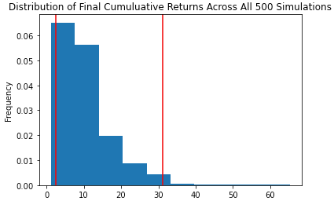

# Financial Planning

### Background
In this project, I developed a prototype application to allow the members to assess their monthly personal finances and also be able to forecast a reasonably good retirement plan based on cryptocurrencies, stocks, and bonds.

I created two financial analysis tools using Jupyter notebooks. The first is a personal finance planner that allows users to visualize their savings composed by investments in shares and cryptocurrencies to assess if they have enough money as an emergency fund.

The second tool is a retirement planning tool that will use the Alpaca API to fetch historical closing prices for a retirement portfolio composed by stocks and bonds and then runs Monte Carlo simulations to project the portfolio performance at 30 years.

## Part 1: Personal Finance Planner

I started by creating a personal finance planner application. To develop the personal finance planner prototype, I took into account the following assumptions:

- *The average household income for each member of the credit union is twelve thousand dollars.*

- *Every union member has a savings portfolio composed of cryptocurrencies, stocks, and bonds.*

### Collect Crypto Prices Using the `requests` Library

I assumed the following amount of crypto assets: `1.2` BTC and `5.3` ETH. Next, I created a variable called `monthly_income` and set its value to `12000`. I used the `requests` library to fetch the current price in US dollars of bitcoin (`BTC`) and ethereum (`ETH`) using the API endpoints provided. I parsed the API JSON response to pick the crypto prices and store each price in a variable. I computed the value of the current amount of cryptocurrencies in US dollars and printed the results.

#### Collect Investments Data Using Alpaca: `SPY` (stocks) and `AGG` (bonds)

Next, I assumed the following amount of shares: `200` `AGG` (bonds) and `50` `SPY` (stocks).

I began by creating an `.env` file in my working directory to store the values of my Alpaca API key and Alpaca secret key. I created the Alpaca API object using the `tradeapi.REST` function from the Alpaca SDK. I formatted the current date as ISO format and changed the date set in the starter code to Today's date. I got the current closing prices for `SPY` and `AGG` using the Alpaca's `get_barset()` function. I transformed the function's response to a Pandas DataFrame. I picked the `SPY` and `AGG` close prices from the Alpaca's `get_barset()` DataFrame response and stored them as Python variables. I printed the closing values for validation. Last, I computed the value in US dollars of the current amount of shares and printed the results.

### Savings Health Analysis

In this section, I assessed the financial health of members. To analyze savings health, I created a DataFrame called `df_savings` with two rows. I stored the total value in US dollars of the crypto assets in the first row and the total value of the shares in the second row. I used the `df_savings` DataFrame to plot a pie chart to visualize the composition of personal savings. I used `if` conditional statements to validate if the current savings are enough for an emergency fund. The ideal emergency fund was equal to three times their monthly income.The conditional statements produce the following:

    - If total savings are greater than the emergency fund, display a message congratulating the person for having enough money in this fund.

    - If total savings are equal to the emergency fund, display a message congratulating the person on reaching this financial goal.

    - If total savings are less than the emergency fund, display a message showing how many dollars away the person is to reach the goal of saving at least three times their monthly expenses.

## Part 2 - Retirement Planning

In this section, I used the Alpaca API to fetch historical closing prices for a retirement portfolio and then ran Monte Carlo simulations to project the portfolio performance at `30` years. I used the Monte Carlo data to answer questions about the portfolio.

### Monte Carlo Simulation

I used the MCForecastTools toolkit to create a Monte Carlo simulation for the retirement portfolio. I used the Alpaca API to fetch five years worth of historical closing prices for a traditional `40/60` portfolio using the `SPY` and `AGG` tickers to represent the `60%` stocks (`SPY`) and `40%` bonds (`AGG`). I ran a Monte Carlo Simulation of `500` and `30` years for the `40/60` portfolio and plot the results.

    

I plotted the probability distribution and confidence intervals.

    

### Retirement Analysis

There is a 95% chance that an initial investment of 20000 USD in the portfolio over the next 30 years will end within in the range of 45010.52 USD and 512165.80 USD

There is a 95% chance that an initial investment of 30000 USD in the portfolio over the next 30 years will end within in the range of 67515.78 USD and 768248.7 USD

There is a 95% chance that an initial investment of 60000 USD in the portfolio over the next 5 years will end within in the range of 55703.31 USD and 91964.76 USD

### Early Retirement

There is a 95% chance that an initial investment of 60000 USD in the portfolio over the next 10 years will end within in the range of 61841.55 USD and 117208.18 USD